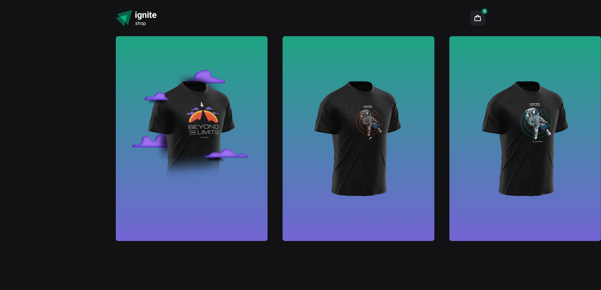
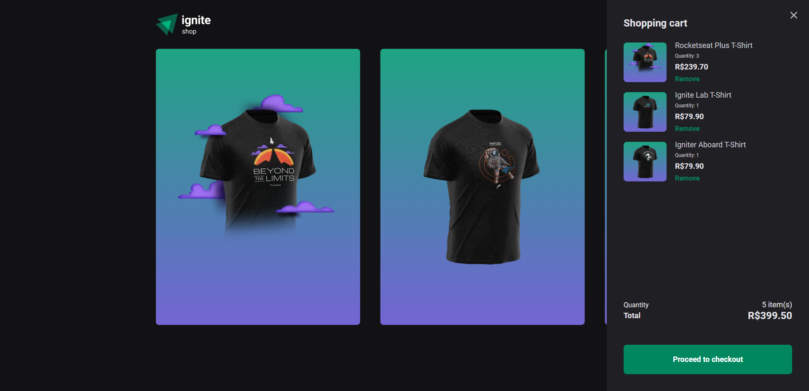
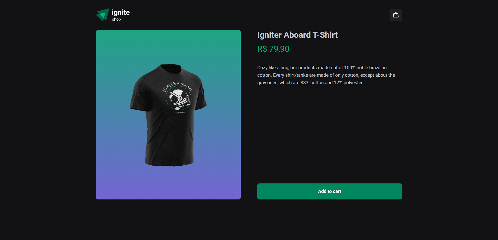
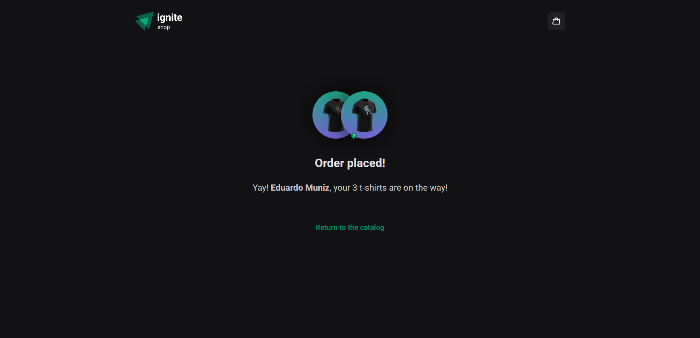

# [Ignite Shop](https://ignite-shop-peach.vercel.app/)
Ignite Shop is an e-commerce based on Rocketseat's t-shirts and is being developed as a study case for Rocketseat's Ignite bootcamp. This app uses Next.js, TypeScript and Stripe to create a functional e-commerce website.



## Status
🚧 Under development 🚧

### Showcase
This app is currently hosted on [vercel](https://ignite-shop-peach.vercel.app/), see [how to use](#how-to-use) for information on how to sucessfully go through the checkout proccess.

## Content table
<!--ts-->
   * [Installing](#Installing)
   * [Sample images](#Sample-images)
   * [How to use](#How-to-use)
   * [Technologies](#Technologies)
<!--te-->

## Installing

### Installation proccess:
First clone/download the repository
```
git clone https://github.com/munizeduardo/Ignite-Shop
```
Then navigate, on your terminal, inside the project folder and install the dependencies.
```
cd Ignite-Shop

npm install

npm run dev
```
It's also important to note that you'll need a Stripe account setup so you'll have access to your own API keys and products.

## Sample images
<h1>
  
    &nbsp;
  
    &nbsp;
  
</h1>

## How to use

This application uses [Stripe](https://stripe.com/)'s API to proccess payment and register products. On checkout, in order to successfully place an order, you should only input test cards from their [documentation](https://stripe.com/docs/testing#cards) in order to protect your personal information.

In order to successfully place an order, you should input:
```
- An e-mail with valid format, it doens't necessarily have to exist, but if it does, it won't be emailed. (i.e. john@doe.com)

- Card information should be filled with a valid test card from Stripe's documentation. (i.e. 4242 4242 4242 4242). Expiration date should be any future date, and CVC any 3 numbers.

- Name on card can be any name, note that it's the name that'll appear on success page after order is placed. (i.e. John Doe)
```

It's important to note that you should refrain from using real information on these fields as these will be stored in Stripe's dashboard in order to register orders.

## Technologies

- [Next.js](https://nextjs.org/)
- [TypeScript](https://www.typescriptlang.org/)
- [Stripe](https://stripe.com/)
- [use-shopping-cart](https://useshoppingcart.com/)
- [Stitches](https://stitches.dev/)
- [Phosphor Icons](https://phosphoricons.com/)
- [Radix](https://www.radix-ui.com/) - [Dialog](https://www.radix-ui.com/docs/primitives/components/dialog)
- [Keen-Slider](https://keen-slider.io/)
- [Axios](https://axios-http.com/)


